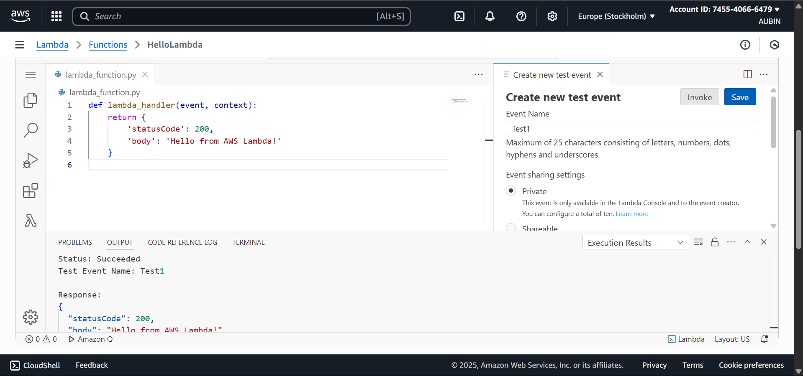
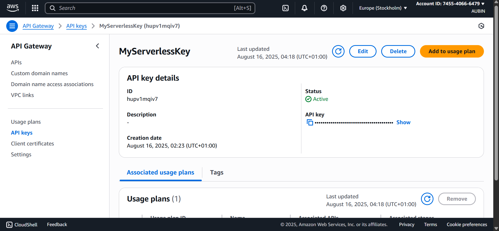
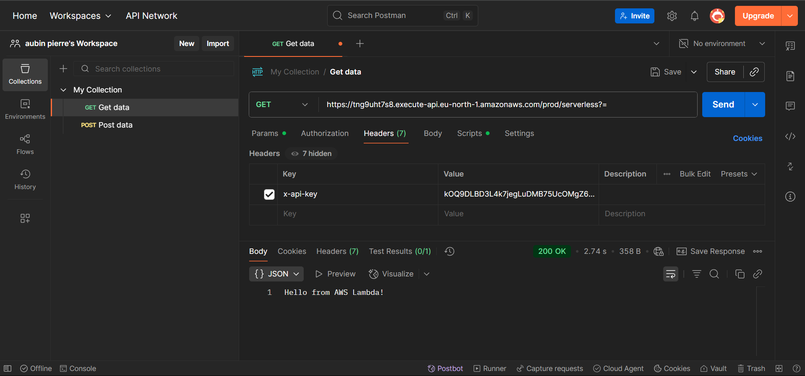

# Defi 4 : API Gateway & AWS Lambda - Cloud & IA Builders

*Theme* : Fondations du Cloud & de l'IA  
Apprendre → Construire → Partager → Gagner  

## Lien vers l'API REST  
*URL de l'API* : [https://tng9uht7s8.execute-api.eu-north-1.amazonaws.com/prod/serverless]  
*Cle API requise* : [kOQ9DLBD3L4k7jegLuDMB75UcOMgZ6Ue7QKIQeG7]  

##  Captures d'écran  

|  |  |  | 

##  Outils utilisés 
- *Langage* : Python  
- *AWS* : Lambda, API Gateway, IAM  
- *Github* 
- *Postman* 

##  Réflexion personnelle  

Ce défi m'a permis d'acquérir des compétences pratiques en serverless avec AWS Lambda et API Gateway tout en renforçant ma maîtrise de Git, ce qui m'ouvre des perspectives concrètes pour des projets cloud scalables et économiques.
Une belle manière de relier la théorie à la pratique merci Educloud !

## Challenge organisé par

[@Educloud Academy](https://www.linkedin.com/company/educloud-academy/) dans le cadre du programme *“Apprendre → Construire → Partager → Gagner”*.

